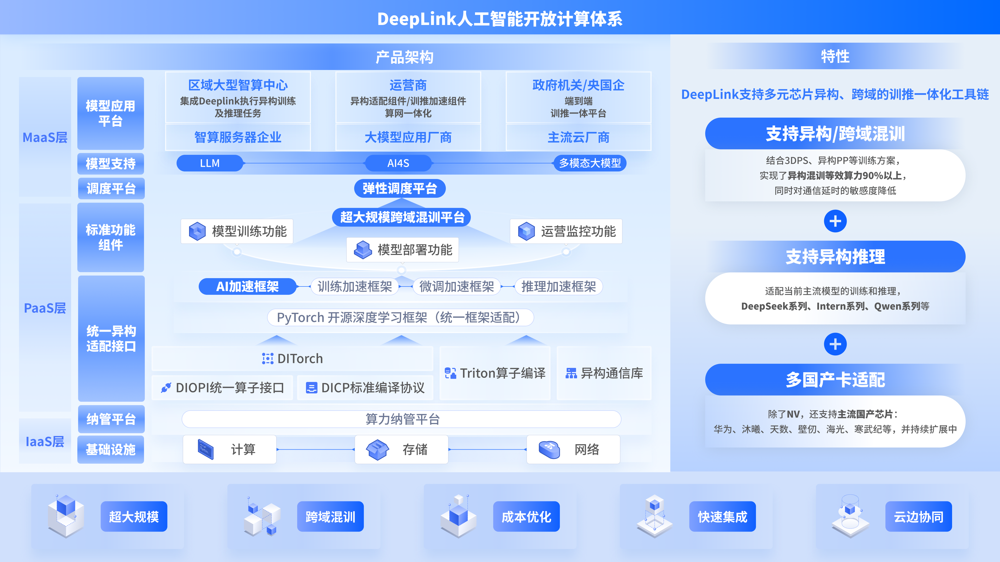

  

    <b>Website</b>
    
      <a href="http://deeplink.org.cn/home">
        <i>HOT</i>
      </a>
    
    &nbsp;&nbsp;|&nbsp;&nbsp;
    <b>Documents</b>
    
      <a href="https://deeplink.readthedocs.io/zh_CN/latest/">
        <i>Tutorial</i>
      </a>
    
    <!-- &nbsp;&nbsp;|&nbsp;&nbsp;
    <b>Research</b>
    
      <a href="https://deeplink.readthedocs.io/zh_CN/latest/">
        <i>HOT</i>
      </a>
     -->
  

  
&nbsp;

  <a href="https://www.xiaohongshu.com/user/profile/6938e581000000003201f9d9?xsec_token=YBc6QKUkU0K9PiG63fS5WQW5qmXUs3yOkv9ZzKUotgF_0%3D&xsec_source=app_share&shareRedId=OD81OEg6PDo2NzUyOTgwNjk1OThKPkpC&apptime=1766633052&share_id=1db09ef5c6ec4a18b261046a1c6574b0&share_channel=copy_link&appuid=6938e581000000003201f9d9&xhsshare=CopyLink"> 小红书 </a> |
  <a href="https://www.zhihu.com/people/ai-18-59-31"> 知乎 </a> |
  <a href="https://blog.csdn.net/DeepLink_2025"> CSDN </a>

<!--<a href="docs/roadmap.md"> 路线图 </a> |-->

<!-- 

  <b>DeepLink 2.0 </b>

 -->
<!--

    <b>训练</b>
    
      <a href="https://deeplink.readthedocs.io/zh-cn/latest/doc/TechSupport/train.html">
        <i>ditorch</i>
      </a>
    
    &nbsp;&nbsp;|&nbsp;&nbsp;
    <b>推理</b>
    
      <a href="https://deeplink.readthedocs.io/zh-cn/latest/doc/TechSupport/infer.html">
        <i>dlinfer</i>
      </a>
    
    &nbsp;&nbsp;|&nbsp;&nbsp;
    <b>编译</b>
    
      <a href="https://deeplink.readthedocs.io/zh-cn/latest/doc/TechSupport/triton.html#dlcompiler">
        <i>dlcompiler</i>
      </a>
    
  
-->

<!-- 人工智能开放计算平台-DeepLink，作为芯片与深度学习框架适配的“桥梁”，根本性实现软硬件解耦，建设开放的软硬件适配生态。遵守此标准可以实现主流框架与芯片高效适配，极大降低算力使用门槛，减少技术阻力。从而打破算力和框架的垄断，实现算力要素多样化。并且通过编译的力量，提升整体的训练效率。基于DeepLink，上下游厂商通过一次适配即可深度接入算法生态，为人工智能软硬上下游合作共建起到关键纽带作用。-->

人工智能开放计算平台-DeepLink，作为芯片与深度学习框架适配的“桥梁”，根本性实现软硬件解耦，建设开放的软硬件适配生态。基于 DeepLink，可支持国产多芯片异构、跨域的训推一体化工具链（输入输出标准化）；上下游厂商通过一次适配即可深度接入算法生态，从根本上打破生态壁垒，实现软硬件解耦和算力要素多样化。

<!-- 为提升软硬件适配效率，充分释放芯片算力，DeepLink定义了一套计算统一接口，可有效解耦框架与芯片的适配过程。同时，我们定期开展硬件测评工作。硬件评测基于团体标准评测方法，以国际主流芯片的性能作为对标，对送测芯片进行技术规格、软件生态、功能、性能等多维度测试，并按季度产出硬件评测报告。评测结论可为各类国产加速卡在不同维度的表现提供参考。 -->

    

<!--   -->

<!-- **DeepLink2.0** 以1.0版本为基础，从场景支持、互联能力、易用性和性能优化四个方向扩展软硬件适配版图。从原本只涵盖AI技术框架、接口层的结构中，逐步扩展了AI并行框架层和计算层： -->

<!-- 1. **AI并行框架**：DeepLink2.0支持开源轻量级AI加速框架InternEvo，支持无需大量依赖关系的模型预训练；同时支持微调工具库XTuner、推理部署工具箱LMDeploy。 -->
<!-- 凭借单一代码库，InternEvo支持在上千GPU的大规模集群上进行预训练，并在单个GPU上进行微调，同时实现显著的性能优化。 -->
<!-- 2. **计算层**：逐步建设triton编译生态，针对硬件特性进行扩展功能加持。 -->
<!-- 3. **接口层**：着力于异构互联方案的建设，通过跨域异构互联可实现不同算力性能的芯片自由组合，而无需依赖单一高算力芯片“抱团”。 -->

<!-- 目前，DeepLink已与10余家硬件企业展开合作，在多个计算平台实现了多个模型的训练和推理适配。-->

<!-- DeepLink从人工智能芯片-深度学习框架的适配实践中总结出来，在二者之间定义了一套计算契约，良好的函数抽象使得上游芯片和下游框架两层在适配工程实施时能有效地解耦。与此同时，基于这种实践，还可以将芯片的适配工作复用到不同的训练框架适配中去。接口的标准化定义包含算子接口（DIOPI）和编译接口（DICP）两个部分。 -->

## 适配中间件
**数字智能**

* [DITorch](https://github.com/DeepLink-org/ditorch)：设备无关 torch。
* [DLCompiler](https://github.com/DeepLink-org/DLCompiler)：扩展 Triton 的深度学习编译器。
* [DLBlas](https://github.com/DeepLink-org/DLBlas)：一个基于 Triton 的运算符库。
* [DLSlime](https://github.com/DeepLink-org/DLSlime)：提供了一套点对点（Peer-to-Peer）通信接口。
* [DLinfer](https://github.com/DeepLink-org/dlinfer)：一套将国产硬件接入大模型推理框架的解决方案。

**物理智能**

* [3DGSTensorCore](https://github.com/DeepLink-org/3DGSTensorCore)：3DGS渲染的加速模块，可以即插即用至常用的3DGS加速框架上。

## 训推系统
* [LightRFT](https://github.com/DeepLink-org/LightRFT)：一个先进的多模态强化学习微调框架，专为大语言模型（LLM）和视觉语言模型（VLM）设计。
* [Pulsing](https://github.com/DeepLink-org/Pulsing)： 是一个轻量级分布式 Actor 框架，专为 LLM 推理服务设计。
* [Persisting](https://github.com/DeepLink-org/Persisting)：参数、键值缓存和轨迹的持久存储。

**混训混推**
* 支持异构/跨域混训、异构推理等的相关方案，尽请期待.

## 智算平台
* [Deeptrace](https://github.com/DeepLink-org/DeepTrace/tree/main)：一种分布式训练中任务排查、诊断的实现方案。
* [probing](https://github.com/DeepLink-org/probing)：一个专为AI应用设计的运行时性能分析和调试工具。

**训推性能建模与通信建模**

* 此方向将服务下一代模型与下一代算力建设，尽请期待。

## 前沿技术

**量子计算**
* [OpenTenNet](https://github.com/DeepLink-org/OpenTenNet)：在新兴算力硬件上构建的量子计算模拟器。

**超节点**
* 面向极致算力增长需求构建的国产超节点技术系统，尽请期待。

## 硬件评测
* [AIChipBenchmark](https://github.com/DeepLink-org/AIChipBenchmark)：面向国产深度学习加速卡进行的多维度评测工作.