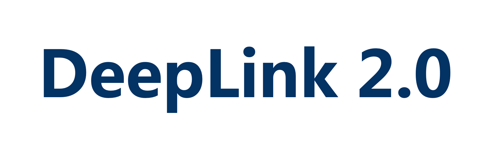
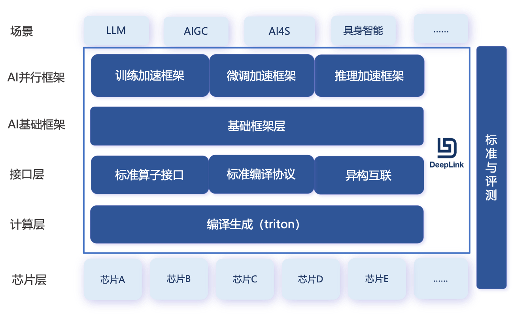

  <!--  -->
  <!-- <b>DeepLink 2.0</b> -->
  
&nbsp;

  

    <b>Website</b>
    
      <a href="http://deeplink.org.cn/home">
        <i>HOT</i>
      </a>
    
    &nbsp;&nbsp;&nbsp;&nbsp;
    <b>Documents</b>
    
      <a href="https://deeplink.readthedocs.io/zh_CN/latest/">
        <i>Tutorial</i>
      </a>
    
    &nbsp;&nbsp;&nbsp;&nbsp;
    <b>Research</b>
    
      <a href="https://deeplink.readthedocs.io/zh_CN/latest/">
        <i>HOT</i>
      </a>
    
  

  <!-- 
&nbsp;
 -->

<!-- 

  <b>DeepLink 2.0 </b>

 -->

    <b>训练</b>
    
      <a href="https://deeplink.readthedocs.io/zh-cn/latest/doc/TechSupport/train.html">
        <i>ditorch</i>
      </a>
    
    &nbsp;&nbsp;|&nbsp;&nbsp;
    <b>推理</b>
    
      <a href="https://deeplink.readthedocs.io/zh-cn/latest/doc/TechSupport/infer.html">
        <i>dlinfer</i>
      </a>
    
    &nbsp;&nbsp;|&nbsp;&nbsp;
    <b>编译</b>
    
      <a href="">
        <i>triton(待开源)</i>
      </a>
    
  

人工智能开放计算平台-DeepLink，作为芯片与深度学习框架适配的“桥梁”，根本性实现软硬件解耦，建设开放的软硬件适配生态。遵守此标准可以实现主流框架与芯片高效适配，极大降低算力使用门槛，减少技术阻力。从而打破算力和框架的垄断，实现算力要素多样化。并且通过编译的力量，提升整体的训练效率。基于DeepLink，上下游厂商通过一次适配即可深度接入算法生态，为人工智能软硬上下游合作共建起到关键纽带作用。

<!-- 为提升软硬件适配效率，充分释放芯片算力，DeepLink定义了一套计算统一接口，可有效解耦框架与芯片的适配过程。同时，我们定期开展硬件测评工作。硬件评测基于团体标准评测方法，以国际主流芯片的性能作为对标，对送测芯片进行技术规格、软件生态、功能、性能等多维度测试，并按季度产出硬件评测报告。评测结论可为各类国产加速卡在不同维度的表现提供参考。 -->

  

  <!--  -->
  

**DeepLink2.0** 以1.0版本为基础，并从场景支持、互联能力、易用性和性能优化四个角度着手扩展软硬件适配版图。从原本只涵盖AI技术框架、接口层的版图中，逐步扩展了AI并行框架层和计算层，支持开源轻量级AI加速框架InternEvo，逐步建设triton编译生态，并着力于异构互联方案的建设：

1. **AI并行框架**：支持无需大量依赖关系的模型预训练。凭借单一代码库，InternEvo支持在上千GPU的大规模集群上进行预训练，并在单个GPU上进行微调，同时实现显著的性能优化。
2. **计算层**：上下层共同发力构建triton生态，针对硬件特性进行扩展功能加持。
3. **接口层**：通过跨域异构互联，可实现不同算力性能的芯片自由组合，而无需依赖单一高算力芯片“抱团”

目前，DeepLink已与10余家硬件企业展开合作，在多个计算平台实现了多个模型的训练和推理适配。

<!-- DeepLink从人工智能芯片-深度学习框架的适配实践中总结出来，在二者之间定义了一套计算契约，良好的函数抽象使得上游芯片和下游框架两层在适配工程实施时能有效地解耦。与此同时，基于这种实践，还可以将芯片的适配工作复用到不同的训练框架适配中去。接口的标准化定义包含算子接口（DIOPI）和编译接口（DICP）两个部分。 -->